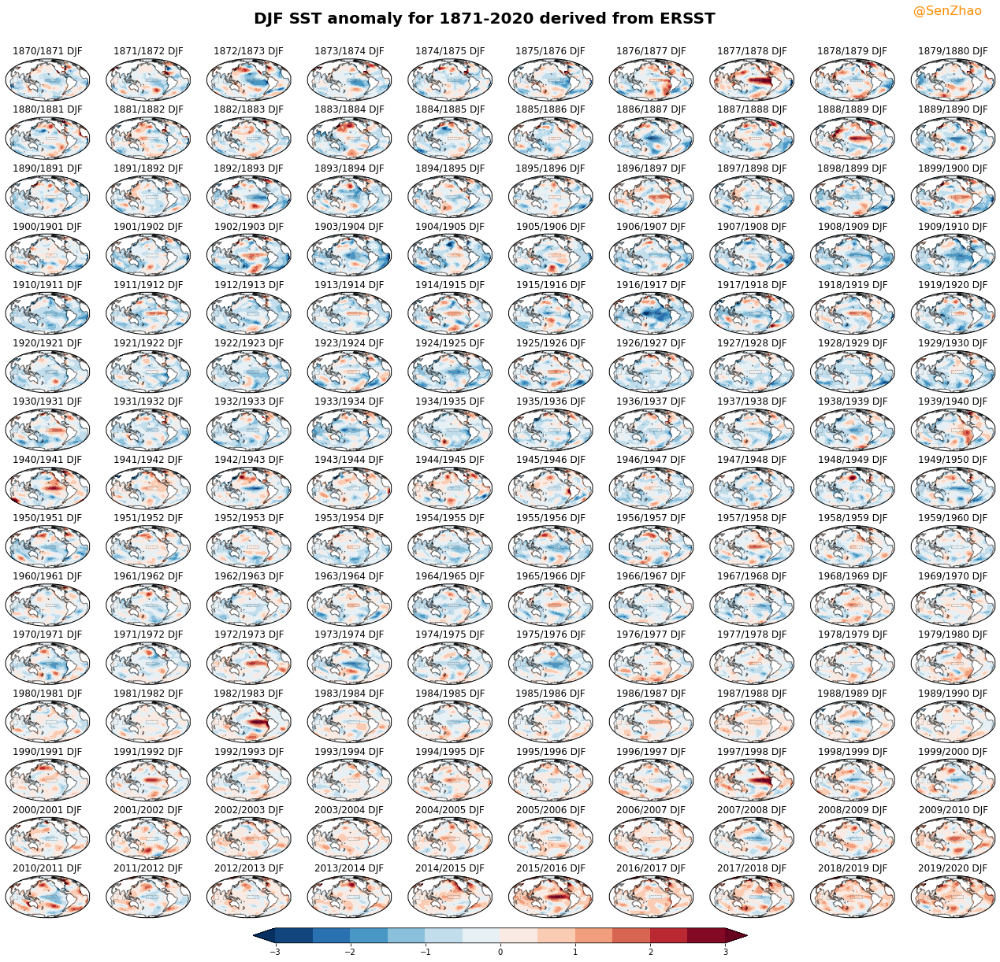
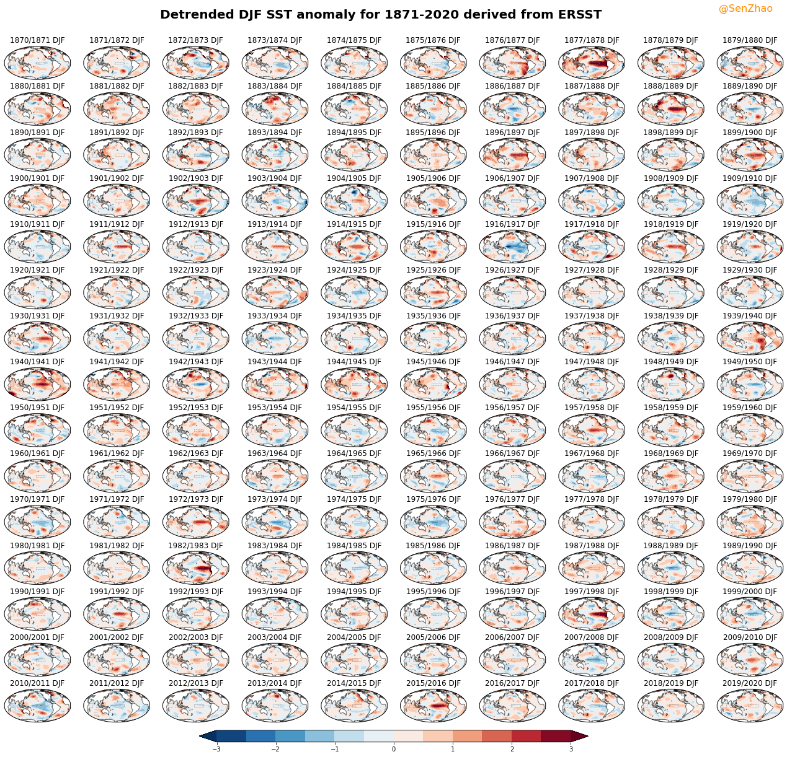

### Load Libraries


```python
%config IPCompleter.greedy = True
# ignore warnings

import os
import warnings
warnings.filterwarnings("ignore")

import numpy as np
import xarray as xr
from statsmodels.tsa.tsatools import detrend

import matplotlib
import matplotlib.pyplot as plt
import matplotlib.cm as mpl_cm
from matplotlib.backends.backend_pdf import PdfPages # one pdf multipage

import cartopy.crs as ccrs
from cartopy.mpl.ticker import LatitudeFormatter, LongitudeFormatter
from shapely.geometry.polygon import LinearRing

## my_pylibs using PYTHONPATH
from climatology import month_to_djf, detrend_3d

R_nino3  = LinearRing(list(zip([210-360, 210-360, 270-360, 270-360], [-5, 5, 5, -5])))
R_nino4  = LinearRing(list(zip([160, 160, 210, 210], [-5, 5, 5, -5])))
R_nino34 = LinearRing(list(zip([190-360, 190-360, 240-360, 240-360], [-5, 5, 5, -5])))
R_nino12 = LinearRing(list(zip([270-360, 270-360, 280-360, 280-360], [-10, 0, 0, -10])))
R_IODW   = LinearRing(list(zip([50, 50, 70, 70], [-10, 10, 10, -10])))
R_IODE   = LinearRing(list(zip([90, 90, 110, 110], [-10, 0, 0, -10])))
R_ALT3   = LinearRing(list(zip([340-360, 340-360, 360-360, 360-360], [-3, 3, 3, -3])))
R_NAT    = LinearRing(list(zip([320-360, 320-360, 340-360, 340-360], [5, 20, 20, 5])))
```

### Calculate Monthly Anomalies Using Xarray


```python
sst_file = "/share/kkraid/zhaos/data/sst/ersst/sst.mnmean.nc"
xr_sst   = xr.open_dataset(sst_file)["sst"][:, ::-1, :] ## latitude is revsered in ersst

## remove the climatology of 1921 to 1980
sst_c = xr_sst.sel(time=slice('1981', '2010')).groupby('time.month').mean('time')
sst_a = xr_sst.groupby('time.month') - sst_c
sst_a
```


<div><svg style="position: absolute; width: 0; height: 0; overflow: hidden">
<defs>
<symbol id="icon-database" viewBox="0 0 32 32">
<title>Show/Hide data repr</title>
<path d="M16 0c-8.837 0-16 2.239-16 5v4c0 2.761 7.163 5 16 5s16-2.239 16-5v-4c0-2.761-7.163-5-16-5z"></path>
<path d="M16 17c-8.837 0-16-2.239-16-5v6c0 2.761 7.163 5 16 5s16-2.239 16-5v-6c0 2.761-7.163 5-16 5z"></path>
<path d="M16 26c-8.837 0-16-2.239-16-5v6c0 2.761 7.163 5 16 5s16-2.239 16-5v-6c0 2.761-7.163 5-16 5z"></path>
</symbol>
<symbol id="icon-file-text2" viewBox="0 0 32 32">
<title>Show/Hide attributes</title>
<path d="M28.681 7.159c-0.694-0.947-1.662-2.053-2.724-3.116s-2.169-2.030-3.116-2.724c-1.612-1.182-2.393-1.319-2.841-1.319h-15.5c-1.378 0-2.5 1.121-2.5 2.5v27c0 1.378 1.122 2.5 2.5 2.5h23c1.378 0 2.5-1.122 2.5-2.5v-19.5c0-0.448-0.137-1.23-1.319-2.841zM24.543 5.457c0.959 0.959 1.712 1.825 2.268 2.543h-4.811v-4.811c0.718 0.556 1.584 1.309 2.543 2.268zM28 29.5c0 0.271-0.229 0.5-0.5 0.5h-23c-0.271 0-0.5-0.229-0.5-0.5v-27c0-0.271 0.229-0.5 0.5-0.5 0 0 15.499-0 15.5 0v7c0 0.552 0.448 1 1 1h7v19.5z"></path>
<path d="M23 26h-14c-0.552 0-1-0.448-1-1s0.448-1 1-1h14c0.552 0 1 0.448 1 1s-0.448 1-1 1z"></path>
<path d="M23 22h-14c-0.552 0-1-0.448-1-1s0.448-1 1-1h14c0.552 0 1 0.448 1 1s-0.448 1-1 1z"></path>
<path d="M23 18h-14c-0.552 0-1-0.448-1-1s0.448-1 1-1h14c0.552 0 1 0.448 1 1s-0.448 1-1 1z"></path>
</symbol>
</defs>
</svg>
<style>/* CSS stylesheet for displaying xarray objects in jupyterlab.
 *
 */

:root {
  --xr-font-color0: var(--jp-content-font-color0, rgba(0, 0, 0, 1));
  --xr-font-color2: var(--jp-content-font-color2, rgba(0, 0, 0, 0.54));
  --xr-font-color3: var(--jp-content-font-color3, rgba(0, 0, 0, 0.38));
  --xr-border-color: var(--jp-border-color2, #e0e0e0);
  --xr-disabled-color: var(--jp-layout-color3, #bdbdbd);
  --xr-background-color: var(--jp-layout-color0, white);
  --xr-background-color-row-even: var(--jp-layout-color1, white);
  --xr-background-color-row-odd: var(--jp-layout-color2, #eeeeee);
}

.xr-wrap {
  min-width: 300px;
  max-width: 700px;
}

.xr-header {
  padding-top: 6px;
  padding-bottom: 6px;
  margin-bottom: 4px;
  border-bottom: solid 1px var(--xr-border-color);
}

.xr-header > div,
.xr-header > ul {
  display: inline;
  margin-top: 0;
  margin-bottom: 0;
}

.xr-obj-type,
.xr-array-name {
  margin-left: 2px;
  margin-right: 10px;
}

.xr-obj-type {
  color: var(--xr-font-color2);
}

.xr-sections {
  padding-left: 0 !important;
  display: grid;
  grid-template-columns: 150px auto auto 1fr 20px 20px;
}

.xr-section-item {
  display: contents;
}

.xr-section-item input {
  display: none;
}

.xr-section-item input + label {
  color: var(--xr-disabled-color);
}

.xr-section-item input:enabled + label {
  cursor: pointer;
  color: var(--xr-font-color2);
}

.xr-section-item input:enabled + label:hover {
  color: var(--xr-font-color0);
}

.xr-section-summary {
  grid-column: 1;
  color: var(--xr-font-color2);
  font-weight: 500;
}

.xr-section-summary > span {
  display: inline-block;
  padding-left: 0.5em;
}

.xr-section-summary-in:disabled + label {
  color: var(--xr-font-color2);
}

.xr-section-summary-in + label:before {
  display: inline-block;
  content: '►';
  font-size: 11px;
  width: 15px;
  text-align: center;
}

.xr-section-summary-in:disabled + label:before {
  color: var(--xr-disabled-color);
}

.xr-section-summary-in:checked + label:before {
  content: '▼';
}

.xr-section-summary-in:checked + label > span {
  display: none;
}

.xr-section-summary,
.xr-section-inline-details {
  padding-top: 4px;
  padding-bottom: 4px;
}

.xr-section-inline-details {
  grid-column: 2 / -1;
}

.xr-section-details {
  display: none;
  grid-column: 1 / -1;
  margin-bottom: 5px;
}

.xr-section-summary-in:checked ~ .xr-section-details {
  display: contents;
}

.xr-array-wrap {
  grid-column: 1 / -1;
  display: grid;
  grid-template-columns: 20px auto;
}

.xr-array-wrap > label {
  grid-column: 1;
  vertical-align: top;
}

.xr-preview {
  color: var(--xr-font-color3);
}

.xr-array-preview,
.xr-array-data {
  padding: 0 5px !important;
  grid-column: 2;
}

.xr-array-data,
.xr-array-in:checked ~ .xr-array-preview {
  display: none;
}

.xr-array-in:checked ~ .xr-array-data,
.xr-array-preview {
  display: inline-block;
}

.xr-dim-list {
  display: inline-block !important;
  list-style: none;
  padding: 0 !important;
  margin: 0;
}

.xr-dim-list li {
  display: inline-block;
  padding: 0;
  margin: 0;
}

.xr-dim-list:before {
  content: '(';
}

.xr-dim-list:after {
  content: ')';
}

.xr-dim-list li:not(:last-child):after {
  content: ',';
  padding-right: 5px;
}

.xr-has-index {
  font-weight: bold;
}

.xr-var-list,
.xr-var-item {
  display: contents;
}

.xr-var-item > div,
.xr-var-item label,
.xr-var-item > .xr-var-name span {
  background-color: var(--xr-background-color-row-even);
  margin-bottom: 0;
}

.xr-var-item > .xr-var-name:hover span {
  padding-right: 5px;
}

.xr-var-list > li:nth-child(odd) > div,
.xr-var-list > li:nth-child(odd) > label,
.xr-var-list > li:nth-child(odd) > .xr-var-name span {
  background-color: var(--xr-background-color-row-odd);
}

.xr-var-name {
  grid-column: 1;
}

.xr-var-dims {
  grid-column: 2;
}

.xr-var-dtype {
  grid-column: 3;
  text-align: right;
  color: var(--xr-font-color2);
}

.xr-var-preview {
  grid-column: 4;
}

.xr-var-name,
.xr-var-dims,
.xr-var-dtype,
.xr-preview,
.xr-attrs dt {
  white-space: nowrap;
  overflow: hidden;
  text-overflow: ellipsis;
  padding-right: 10px;
}

.xr-var-name:hover,
.xr-var-dims:hover,
.xr-var-dtype:hover,
.xr-attrs dt:hover {
  overflow: visible;
  width: auto;
  z-index: 1;
}

.xr-var-attrs,
.xr-var-data {
  display: none;
  background-color: var(--xr-background-color) !important;
  padding-bottom: 5px !important;
}

.xr-var-attrs-in:checked ~ .xr-var-attrs,
.xr-var-data-in:checked ~ .xr-var-data {
  display: block;
}

.xr-var-data > table {
  float: right;
}

.xr-var-name span,
.xr-var-data,
.xr-attrs {
  padding-left: 25px !important;
}

.xr-attrs,
.xr-var-attrs,
.xr-var-data {
  grid-column: 1 / -1;
}

dl.xr-attrs {
  padding: 0;
  margin: 0;
  display: grid;
  grid-template-columns: 125px auto;
}

.xr-attrs dt, dd {
  padding: 0;
  margin: 0;
  float: left;
  padding-right: 10px;
  width: auto;
}

.xr-attrs dt {
  font-weight: normal;
  grid-column: 1;
}

.xr-attrs dt:hover span {
  display: inline-block;
  background: var(--xr-background-color);
  padding-right: 10px;
}

.xr-attrs dd {
  grid-column: 2;
  white-space: pre-wrap;
  word-break: break-all;
}

.xr-icon-database,
.xr-icon-file-text2 {
  display: inline-block;
  vertical-align: middle;
  width: 1em;
  height: 1.5em !important;
  stroke-width: 0;
  stroke: currentColor;
  fill: currentColor;
}
</style><div class='xr-wrap'><div class='xr-header'><div class='xr-obj-type'>xarray.DataArray</div><div class='xr-array-name'>'sst'</div><ul class='xr-dim-list'><li><span class='xr-has-index'>time</span>: 1995</li><li><span class='xr-has-index'>lat</span>: 89</li><li><span class='xr-has-index'>lon</span>: 180</li></ul></div><ul class='xr-sections'><li class='xr-section-item'><div class='xr-array-wrap'><input id='section-e0280fdb-1ced-4285-8150-2fb4ee656269' class='xr-array-in' type='checkbox' ><label for='section-e0280fdb-1ced-4285-8150-2fb4ee656269' title='Show/hide data repr'><svg class='icon xr-icon-database'><use xlink:href='#icon-database'></use></svg></label><div class='xr-array-preview xr-preview'><span>nan nan nan nan ... -4.7683716e-07 -4.7683716e-07 -4.7683716e-07</span></div><pre class='xr-array-data'>array([[[           nan,            nan,            nan, ...,
                    nan,            nan,            nan],
        [           nan,            nan,            nan, ...,
                    nan,            nan,            nan],
        [           nan,            nan,            nan, ...,
                    nan,            nan,            nan],
        ...,
        [-4.7683716e-07, -4.7683716e-07, -4.7683716e-07, ...,
         -4.7683716e-07, -4.7683716e-07, -4.7683716e-07],
        [-4.7683716e-07, -4.7683716e-07, -4.7683716e-07, ...,
         -4.7683716e-07, -4.7683716e-07, -4.7683716e-07],
        [-4.7683716e-07, -4.7683716e-07, -4.7683716e-07, ...,
         -4.7683716e-07, -4.7683716e-07, -4.7683716e-07]],

       [[           nan,            nan,            nan, ...,
                    nan,            nan,            nan],
        [           nan,            nan,            nan, ...,
                    nan,            nan,            nan],
        [           nan,            nan,            nan, ...,
                    nan,            nan,            nan],
        ...,
        [-4.7683716e-07, -4.7683716e-07, -4.7683716e-07, ...,
         -4.7683716e-07, -4.7683716e-07, -4.7683716e-07],
        [-4.7683716e-07, -4.7683716e-07, -4.7683716e-07, ...,
         -4.7683716e-07, -4.7683716e-07, -4.7683716e-07],
        [-4.7683716e-07, -4.7683716e-07, -4.7683716e-07, ...,
         -4.7683716e-07, -4.7683716e-07, -4.7683716e-07]],

       [[           nan,            nan,            nan, ...,
                    nan,            nan,            nan],
        [           nan,            nan,            nan, ...,
                    nan,            nan,            nan],
        [           nan,            nan,            nan, ...,
                    nan,            nan,            nan],
        ...,
        [-4.7683716e-07, -4.7683716e-07, -4.7683716e-07, ...,
         -4.7683716e-07, -4.7683716e-07, -4.7683716e-07],
        [-4.7683716e-07, -4.7683716e-07, -4.7683716e-07, ...,
         -4.7683716e-07, -4.7683716e-07, -4.7683716e-07],
        [-4.7683716e-07, -4.7683716e-07, -4.7683716e-07, ...,
         -4.7683716e-07, -4.7683716e-07, -4.7683716e-07]],

       ...,

       [[           nan,            nan,            nan, ...,
                    nan,            nan,            nan],
        [           nan,            nan,            nan, ...,
                    nan,            nan,            nan],
        [           nan,            nan,            nan, ...,
                    nan,            nan,            nan],
        ...,
        [-4.7683716e-07, -4.7683716e-07, -4.7683716e-07, ...,
         -4.7683716e-07, -4.7683716e-07, -4.7683716e-07],
        [-4.7683716e-07, -4.7683716e-07, -4.7683716e-07, ...,
         -4.7683716e-07, -4.7683716e-07, -4.7683716e-07],
        [-4.7683716e-07, -4.7683716e-07, -4.7683716e-07, ...,
         -4.7683716e-07, -4.7683716e-07, -4.7683716e-07]],

       [[           nan,            nan,            nan, ...,
                    nan,            nan,            nan],
        [           nan,            nan,            nan, ...,
                    nan,            nan,            nan],
        [           nan,            nan,            nan, ...,
                    nan,            nan,            nan],
        ...,
        [-4.7683716e-07, -4.7683716e-07, -4.7683716e-07, ...,
         -4.7683716e-07, -4.7683716e-07, -4.7683716e-07],
        [-4.7683716e-07, -4.7683716e-07, -4.7683716e-07, ...,
         -4.7683716e-07, -4.7683716e-07, -4.7683716e-07],
        [-4.7683716e-07, -4.7683716e-07, -4.7683716e-07, ...,
         -4.7683716e-07, -4.7683716e-07, -4.7683716e-07]],

       [[           nan,            nan,            nan, ...,
                    nan,            nan,            nan],
        [           nan,            nan,            nan, ...,
                    nan,            nan,            nan],
        [           nan,            nan,            nan, ...,
                    nan,            nan,            nan],
        ...,
        [-4.7683716e-07, -4.7683716e-07, -4.7683716e-07, ...,
         -4.7683716e-07, -4.7683716e-07, -4.7683716e-07],
        [-4.7683716e-07, -4.7683716e-07, -4.7683716e-07, ...,
         -4.7683716e-07, -4.7683716e-07, -4.7683716e-07],
        [-4.7683716e-07, -4.7683716e-07, -4.7683716e-07, ...,
         -4.7683716e-07, -4.7683716e-07, -4.7683716e-07]]], dtype=float32)</pre></div></li><li class='xr-section-item'><input id='section-8ebf0106-c928-4e96-bf21-7b8b299e406c' class='xr-section-summary-in' type='checkbox'  checked><label for='section-8ebf0106-c928-4e96-bf21-7b8b299e406c' class='xr-section-summary' >Coordinates: <span>(4)</span></label><div class='xr-section-inline-details'></div><div class='xr-section-details'><ul class='xr-var-list'><li class='xr-var-item'><div class='xr-var-name'><span class='xr-has-index'>lat</span></div><div class='xr-var-dims'>(lat)</div><div class='xr-var-dtype'>float32</div><div class='xr-var-preview xr-preview'>-88.0 -86.0 -84.0 ... 86.0 88.0</div><input id='attrs-77b73acc-2500-45bd-b544-9bb7b071d092' class='xr-var-attrs-in' type='checkbox' ><label for='attrs-77b73acc-2500-45bd-b544-9bb7b071d092' title='Show/Hide attributes'><svg class='icon xr-icon-file-text2'><use xlink:href='#icon-file-text2'></use></svg></label><input id='data-7fbe2829-9222-4a04-95af-bd3951727469' class='xr-var-data-in' type='checkbox'><label for='data-7fbe2829-9222-4a04-95af-bd3951727469' title='Show/Hide data repr'><svg class='icon xr-icon-database'><use xlink:href='#icon-database'></use></svg></label><div class='xr-var-attrs'><dl class='xr-attrs'><dt><span>units :</span></dt><dd>degrees_north</dd><dt><span>long_name :</span></dt><dd>Latitude</dd><dt><span>actual_range :</span></dt><dd>[ 88. -88.]</dd><dt><span>standard_name :</span></dt><dd>latitude</dd><dt><span>axis :</span></dt><dd>Y</dd><dt><span>coordinate_defines :</span></dt><dd>center</dd></dl></div><pre class='xr-var-data'>array([-88., -86., -84., -82., -80., -78., -76., -74., -72., -70., -68., -66.,
       -64., -62., -60., -58., -56., -54., -52., -50., -48., -46., -44., -42.,
       -40., -38., -36., -34., -32., -30., -28., -26., -24., -22., -20., -18.,
       -16., -14., -12., -10.,  -8.,  -6.,  -4.,  -2.,   0.,   2.,   4.,   6.,
         8.,  10.,  12.,  14.,  16.,  18.,  20.,  22.,  24.,  26.,  28.,  30.,
        32.,  34.,  36.,  38.,  40.,  42.,  44.,  46.,  48.,  50.,  52.,  54.,
        56.,  58.,  60.,  62.,  64.,  66.,  68.,  70.,  72.,  74.,  76.,  78.,
        80.,  82.,  84.,  86.,  88.], dtype=float32)</pre></li><li class='xr-var-item'><div class='xr-var-name'><span class='xr-has-index'>lon</span></div><div class='xr-var-dims'>(lon)</div><div class='xr-var-dtype'>float32</div><div class='xr-var-preview xr-preview'>0.0 2.0 4.0 ... 354.0 356.0 358.0</div><input id='attrs-a72ab0a8-84f5-489b-8516-fcec86b7703e' class='xr-var-attrs-in' type='checkbox' ><label for='attrs-a72ab0a8-84f5-489b-8516-fcec86b7703e' title='Show/Hide attributes'><svg class='icon xr-icon-file-text2'><use xlink:href='#icon-file-text2'></use></svg></label><input id='data-9c1bc791-aae8-4b45-aa9c-ff47720b0fc1' class='xr-var-data-in' type='checkbox'><label for='data-9c1bc791-aae8-4b45-aa9c-ff47720b0fc1' title='Show/Hide data repr'><svg class='icon xr-icon-database'><use xlink:href='#icon-database'></use></svg></label><div class='xr-var-attrs'><dl class='xr-attrs'><dt><span>units :</span></dt><dd>degrees_east</dd><dt><span>long_name :</span></dt><dd>Longitude</dd><dt><span>actual_range :</span></dt><dd>[  0. 358.]</dd><dt><span>standard_name :</span></dt><dd>longitude</dd><dt><span>axis :</span></dt><dd>X</dd><dt><span>coordinate_defines :</span></dt><dd>center</dd></dl></div><pre class='xr-var-data'>array([  0.,   2.,   4.,   6.,   8.,  10.,  12.,  14.,  16.,  18.,  20.,  22.,
        24.,  26.,  28.,  30.,  32.,  34.,  36.,  38.,  40.,  42.,  44.,  46.,
        48.,  50.,  52.,  54.,  56.,  58.,  60.,  62.,  64.,  66.,  68.,  70.,
        72.,  74.,  76.,  78.,  80.,  82.,  84.,  86.,  88.,  90.,  92.,  94.,
        96.,  98., 100., 102., 104., 106., 108., 110., 112., 114., 116., 118.,
       120., 122., 124., 126., 128., 130., 132., 134., 136., 138., 140., 142.,
       144., 146., 148., 150., 152., 154., 156., 158., 160., 162., 164., 166.,
       168., 170., 172., 174., 176., 178., 180., 182., 184., 186., 188., 190.,
       192., 194., 196., 198., 200., 202., 204., 206., 208., 210., 212., 214.,
       216., 218., 220., 222., 224., 226., 228., 230., 232., 234., 236., 238.,
       240., 242., 244., 246., 248., 250., 252., 254., 256., 258., 260., 262.,
       264., 266., 268., 270., 272., 274., 276., 278., 280., 282., 284., 286.,
       288., 290., 292., 294., 296., 298., 300., 302., 304., 306., 308., 310.,
       312., 314., 316., 318., 320., 322., 324., 326., 328., 330., 332., 334.,
       336., 338., 340., 342., 344., 346., 348., 350., 352., 354., 356., 358.],
      dtype=float32)</pre></li><li class='xr-var-item'><div class='xr-var-name'><span class='xr-has-index'>time</span></div><div class='xr-var-dims'>(time)</div><div class='xr-var-dtype'>datetime64[ns]</div><div class='xr-var-preview xr-preview'>1854-01-01 ... 2020-03-01</div><input id='attrs-02e2bbe5-f931-4f66-a50f-d254f26be927' class='xr-var-attrs-in' type='checkbox' ><label for='attrs-02e2bbe5-f931-4f66-a50f-d254f26be927' title='Show/Hide attributes'><svg class='icon xr-icon-file-text2'><use xlink:href='#icon-file-text2'></use></svg></label><input id='data-2089b2aa-88a8-4cd9-a97e-ab5e0d6da097' class='xr-var-data-in' type='checkbox'><label for='data-2089b2aa-88a8-4cd9-a97e-ab5e0d6da097' title='Show/Hide data repr'><svg class='icon xr-icon-database'><use xlink:href='#icon-database'></use></svg></label><div class='xr-var-attrs'><dl class='xr-attrs'><dt><span>long_name :</span></dt><dd>Time</dd><dt><span>delta_t :</span></dt><dd>0000-01-00 00:00:00</dd><dt><span>avg_period :</span></dt><dd>0000-01-00 00:00:00</dd><dt><span>prev_avg_period :</span></dt><dd>0000-00-07 00:00:00</dd><dt><span>standard_name :</span></dt><dd>time</dd><dt><span>axis :</span></dt><dd>T</dd><dt><span>actual_range :</span></dt><dd>[19723. 80413.]</dd></dl></div><pre class='xr-var-data'>array([&#x27;1854-01-01T00:00:00.000000000&#x27;, &#x27;1854-02-01T00:00:00.000000000&#x27;,
       &#x27;1854-03-01T00:00:00.000000000&#x27;, ..., &#x27;2020-01-01T00:00:00.000000000&#x27;,
       &#x27;2020-02-01T00:00:00.000000000&#x27;, &#x27;2020-03-01T00:00:00.000000000&#x27;],
      dtype=&#x27;datetime64[ns]&#x27;)</pre></li><li class='xr-var-item'><div class='xr-var-name'><span>month</span></div><div class='xr-var-dims'>(time)</div><div class='xr-var-dtype'>int64</div><div class='xr-var-preview xr-preview'>1 2 3 4 5 6 7 ... 9 10 11 12 1 2 3</div><input id='attrs-f74d5f14-2bcf-4eab-943a-e890e1ff28f7' class='xr-var-attrs-in' type='checkbox' disabled><label for='attrs-f74d5f14-2bcf-4eab-943a-e890e1ff28f7' title='Show/Hide attributes'><svg class='icon xr-icon-file-text2'><use xlink:href='#icon-file-text2'></use></svg></label><input id='data-0b5a5d20-febe-4e77-8993-d9d69ba01278' class='xr-var-data-in' type='checkbox'><label for='data-0b5a5d20-febe-4e77-8993-d9d69ba01278' title='Show/Hide data repr'><svg class='icon xr-icon-database'><use xlink:href='#icon-database'></use></svg></label><div class='xr-var-attrs'><dl class='xr-attrs'></dl></div><pre class='xr-var-data'>array([1, 2, 3, ..., 1, 2, 3])</pre></li></ul></div></li><li class='xr-section-item'><input id='section-4bda21b7-fa9a-4264-ae0a-88e2d0748513' class='xr-section-summary-in' type='checkbox' disabled ><label for='section-4bda21b7-fa9a-4264-ae0a-88e2d0748513' class='xr-section-summary'  title='Expand/collapse section'>Attributes: <span>(0)</span></label><div class='xr-section-inline-details'></div><div class='xr-section-details'><dl class='xr-attrs'></dl></div></li></ul></div></div>


### Calculate Detrended Anomalies


```python
sst_ad = detrend_3d(sst_a, order=2)
sst_ad
```


<div><svg style="position: absolute; width: 0; height: 0; overflow: hidden">
<defs>
<symbol id="icon-database" viewBox="0 0 32 32">
<title>Show/Hide data repr</title>
<path d="M16 0c-8.837 0-16 2.239-16 5v4c0 2.761 7.163 5 16 5s16-2.239 16-5v-4c0-2.761-7.163-5-16-5z"></path>
<path d="M16 17c-8.837 0-16-2.239-16-5v6c0 2.761 7.163 5 16 5s16-2.239 16-5v-6c0 2.761-7.163 5-16 5z"></path>
<path d="M16 26c-8.837 0-16-2.239-16-5v6c0 2.761 7.163 5 16 5s16-2.239 16-5v-6c0 2.761-7.163 5-16 5z"></path>
</symbol>
<symbol id="icon-file-text2" viewBox="0 0 32 32">
<title>Show/Hide attributes</title>
<path d="M28.681 7.159c-0.694-0.947-1.662-2.053-2.724-3.116s-2.169-2.030-3.116-2.724c-1.612-1.182-2.393-1.319-2.841-1.319h-15.5c-1.378 0-2.5 1.121-2.5 2.5v27c0 1.378 1.122 2.5 2.5 2.5h23c1.378 0 2.5-1.122 2.5-2.5v-19.5c0-0.448-0.137-1.23-1.319-2.841zM24.543 5.457c0.959 0.959 1.712 1.825 2.268 2.543h-4.811v-4.811c0.718 0.556 1.584 1.309 2.543 2.268zM28 29.5c0 0.271-0.229 0.5-0.5 0.5h-23c-0.271 0-0.5-0.229-0.5-0.5v-27c0-0.271 0.229-0.5 0.5-0.5 0 0 15.499-0 15.5 0v7c0 0.552 0.448 1 1 1h7v19.5z"></path>
<path d="M23 26h-14c-0.552 0-1-0.448-1-1s0.448-1 1-1h14c0.552 0 1 0.448 1 1s-0.448 1-1 1z"></path>
<path d="M23 22h-14c-0.552 0-1-0.448-1-1s0.448-1 1-1h14c0.552 0 1 0.448 1 1s-0.448 1-1 1z"></path>
<path d="M23 18h-14c-0.552 0-1-0.448-1-1s0.448-1 1-1h14c0.552 0 1 0.448 1 1s-0.448 1-1 1z"></path>
</symbol>
</defs>
</svg>
<style>/* CSS stylesheet for displaying xarray objects in jupyterlab.
 *
 */

:root {
  --xr-font-color0: var(--jp-content-font-color0, rgba(0, 0, 0, 1));
  --xr-font-color2: var(--jp-content-font-color2, rgba(0, 0, 0, 0.54));
  --xr-font-color3: var(--jp-content-font-color3, rgba(0, 0, 0, 0.38));
  --xr-border-color: var(--jp-border-color2, #e0e0e0);
  --xr-disabled-color: var(--jp-layout-color3, #bdbdbd);
  --xr-background-color: var(--jp-layout-color0, white);
  --xr-background-color-row-even: var(--jp-layout-color1, white);
  --xr-background-color-row-odd: var(--jp-layout-color2, #eeeeee);
}

.xr-wrap {
  min-width: 300px;
  max-width: 700px;
}

.xr-header {
  padding-top: 6px;
  padding-bottom: 6px;
  margin-bottom: 4px;
  border-bottom: solid 1px var(--xr-border-color);
}

.xr-header > div,
.xr-header > ul {
  display: inline;
  margin-top: 0;
  margin-bottom: 0;
}

.xr-obj-type,
.xr-array-name {
  margin-left: 2px;
  margin-right: 10px;
}

.xr-obj-type {
  color: var(--xr-font-color2);
}

.xr-sections {
  padding-left: 0 !important;
  display: grid;
  grid-template-columns: 150px auto auto 1fr 20px 20px;
}

.xr-section-item {
  display: contents;
}

.xr-section-item input {
  display: none;
}

.xr-section-item input + label {
  color: var(--xr-disabled-color);
}

.xr-section-item input:enabled + label {
  cursor: pointer;
  color: var(--xr-font-color2);
}

.xr-section-item input:enabled + label:hover {
  color: var(--xr-font-color0);
}

.xr-section-summary {
  grid-column: 1;
  color: var(--xr-font-color2);
  font-weight: 500;
}

.xr-section-summary > span {
  display: inline-block;
  padding-left: 0.5em;
}

.xr-section-summary-in:disabled + label {
  color: var(--xr-font-color2);
}

.xr-section-summary-in + label:before {
  display: inline-block;
  content: '►';
  font-size: 11px;
  width: 15px;
  text-align: center;
}

.xr-section-summary-in:disabled + label:before {
  color: var(--xr-disabled-color);
}

.xr-section-summary-in:checked + label:before {
  content: '▼';
}

.xr-section-summary-in:checked + label > span {
  display: none;
}

.xr-section-summary,
.xr-section-inline-details {
  padding-top: 4px;
  padding-bottom: 4px;
}

.xr-section-inline-details {
  grid-column: 2 / -1;
}

.xr-section-details {
  display: none;
  grid-column: 1 / -1;
  margin-bottom: 5px;
}

.xr-section-summary-in:checked ~ .xr-section-details {
  display: contents;
}

.xr-array-wrap {
  grid-column: 1 / -1;
  display: grid;
  grid-template-columns: 20px auto;
}

.xr-array-wrap > label {
  grid-column: 1;
  vertical-align: top;
}

.xr-preview {
  color: var(--xr-font-color3);
}

.xr-array-preview,
.xr-array-data {
  padding: 0 5px !important;
  grid-column: 2;
}

.xr-array-data,
.xr-array-in:checked ~ .xr-array-preview {
  display: none;
}

.xr-array-in:checked ~ .xr-array-data,
.xr-array-preview {
  display: inline-block;
}

.xr-dim-list {
  display: inline-block !important;
  list-style: none;
  padding: 0 !important;
  margin: 0;
}

.xr-dim-list li {
  display: inline-block;
  padding: 0;
  margin: 0;
}

.xr-dim-list:before {
  content: '(';
}

.xr-dim-list:after {
  content: ')';
}

.xr-dim-list li:not(:last-child):after {
  content: ',';
  padding-right: 5px;
}

.xr-has-index {
  font-weight: bold;
}

.xr-var-list,
.xr-var-item {
  display: contents;
}

.xr-var-item > div,
.xr-var-item label,
.xr-var-item > .xr-var-name span {
  background-color: var(--xr-background-color-row-even);
  margin-bottom: 0;
}

.xr-var-item > .xr-var-name:hover span {
  padding-right: 5px;
}

.xr-var-list > li:nth-child(odd) > div,
.xr-var-list > li:nth-child(odd) > label,
.xr-var-list > li:nth-child(odd) > .xr-var-name span {
  background-color: var(--xr-background-color-row-odd);
}

.xr-var-name {
  grid-column: 1;
}

.xr-var-dims {
  grid-column: 2;
}

.xr-var-dtype {
  grid-column: 3;
  text-align: right;
  color: var(--xr-font-color2);
}

.xr-var-preview {
  grid-column: 4;
}

.xr-var-name,
.xr-var-dims,
.xr-var-dtype,
.xr-preview,
.xr-attrs dt {
  white-space: nowrap;
  overflow: hidden;
  text-overflow: ellipsis;
  padding-right: 10px;
}

.xr-var-name:hover,
.xr-var-dims:hover,
.xr-var-dtype:hover,
.xr-attrs dt:hover {
  overflow: visible;
  width: auto;
  z-index: 1;
}

.xr-var-attrs,
.xr-var-data {
  display: none;
  background-color: var(--xr-background-color) !important;
  padding-bottom: 5px !important;
}

.xr-var-attrs-in:checked ~ .xr-var-attrs,
.xr-var-data-in:checked ~ .xr-var-data {
  display: block;
}

.xr-var-data > table {
  float: right;
}

.xr-var-name span,
.xr-var-data,
.xr-attrs {
  padding-left: 25px !important;
}

.xr-attrs,
.xr-var-attrs,
.xr-var-data {
  grid-column: 1 / -1;
}

dl.xr-attrs {
  padding: 0;
  margin: 0;
  display: grid;
  grid-template-columns: 125px auto;
}

.xr-attrs dt, dd {
  padding: 0;
  margin: 0;
  float: left;
  padding-right: 10px;
  width: auto;
}

.xr-attrs dt {
  font-weight: normal;
  grid-column: 1;
}

.xr-attrs dt:hover span {
  display: inline-block;
  background: var(--xr-background-color);
  padding-right: 10px;
}

.xr-attrs dd {
  grid-column: 2;
  white-space: pre-wrap;
  word-break: break-all;
}

.xr-icon-database,
.xr-icon-file-text2 {
  display: inline-block;
  vertical-align: middle;
  width: 1em;
  height: 1.5em !important;
  stroke-width: 0;
  stroke: currentColor;
  fill: currentColor;
}
</style><div class='xr-wrap'><div class='xr-header'><div class='xr-obj-type'>xarray.DataArray</div><div class='xr-array-name'>'sst'</div><ul class='xr-dim-list'><li><span class='xr-has-index'>time</span>: 1995</li><li><span class='xr-has-index'>lat</span>: 89</li><li><span class='xr-has-index'>lon</span>: 180</li></ul></div><ul class='xr-sections'><li class='xr-section-item'><div class='xr-array-wrap'><input id='section-692fcbf9-a5cb-4de3-918e-34bbf8912b11' class='xr-array-in' type='checkbox' ><label for='section-692fcbf9-a5cb-4de3-918e-34bbf8912b11' title='Show/hide data repr'><svg class='icon xr-icon-database'><use xlink:href='#icon-database'></use></svg></label><div class='xr-array-preview xr-preview'><span>nan nan nan nan nan ... -0.00104 -0.001279 -0.001608 -0.001837</span></div><pre class='xr-array-data'>array([[[            nan,             nan,             nan, ...,
                     nan,             nan,             nan],
        [            nan,             nan,             nan, ...,
                     nan,             nan,             nan],
        [            nan,             nan,             nan, ...,
                     nan,             nan,             nan],
        ...,
        [-1.50012343e-05, -1.63123177e-04, -2.54675130e-04, ...,
         -1.25514046e-04, -8.37891097e-05, -3.68078858e-05],
        [-5.15164873e-04, -5.86208848e-04, -6.33782411e-04, ...,
         -1.28441156e-04, -3.15088757e-04, -4.21273808e-04],
        [-5.55420499e-04, -5.43916605e-04, -5.36408824e-04, ...,
         -3.91787800e-04, -4.92146299e-04, -5.61794689e-04]],

       [[            nan,             nan,             nan, ...,
                     nan,             nan,             nan],
        [            nan,             nan,             nan, ...,
                     nan,             nan,             nan],
        [            nan,             nan,             nan, ...,
                     nan,             nan,             nan],
        ...,
        [-1.49400631e-05, -1.62453558e-04, -2.53629692e-04, ...,
         -1.24991879e-04, -8.34474391e-05, -3.66577926e-05],
        [-5.13050216e-04, -5.83802518e-04, -6.31180742e-04, ...,
         -1.27913906e-04, -3.13795356e-04, -4.19544564e-04],
        [-5.53141942e-04, -5.41684356e-04, -5.34207161e-04, ...,
         -3.90181819e-04, -4.90128434e-04, -5.59490858e-04]],

       [[            nan,             nan,             nan, ...,
                     nan,             nan,             nan],
        [            nan,             nan,             nan, ...,
                     nan,             nan,             nan],
        [            nan,             nan,             nan, ...,
                     nan,             nan,             nan],
        ...,
        [-1.48789699e-05, -1.61784799e-04, -2.52585595e-04, ...,
         -1.24470379e-04, -8.31062041e-05, -3.65078908e-05],
        [-5.10938273e-04, -5.81399277e-04, -6.28582412e-04, ...,
         -1.27387334e-04, -3.12503614e-04, -4.17817539e-04],
        [-5.50866307e-04, -5.39454971e-04, -5.32008324e-04, ...,
         -3.88577895e-04, -4.88113155e-04, -5.57189981e-04]],

       ...,

       [[            nan,             nan,             nan, ...,
                     nan,             nan,             nan],
        [            nan,             nan,             nan, ...,
                     nan,             nan,             nan],
        [            nan,             nan,             nan, ...,
                     nan,             nan,             nan],
        ...,
        [-4.78031911e-05, -5.33474152e-04, -8.32883478e-04, ...,
         -4.07385067e-04, -2.67003817e-04, -1.17292642e-04],
        [-1.68451099e-03, -1.91696794e-03, -2.07270690e-03, ...,
         -4.20050896e-04, -1.03035331e-03, -1.37747909e-03],
        [-1.81201404e-03, -1.77720690e-03, -1.75336931e-03, ...,
         -1.27421476e-03, -1.60215659e-03, -1.83011836e-03]],

       [[            nan,             nan,             nan, ...,
                     nan,             nan,             nan],
        [            nan,             nan,             nan, ...,
                     nan,             nan,             nan],
        [            nan,             nan,             nan, ...,
                     nan,             nan,             nan],
        ...,
        [-4.78973740e-05, -5.34516468e-04, -8.34510788e-04, ...,
         -4.08190903e-04, -2.67529874e-04, -1.17523734e-04],
        [-1.68780240e-03, -1.92071346e-03, -2.07675661e-03, ...,
         -4.20871603e-04, -1.03236651e-03, -1.38017060e-03],
        [-1.81555716e-03, -1.78068026e-03, -1.75679565e-03, ...,
         -1.27670877e-03, -1.60529151e-03, -1.83369856e-03]],

       [[            nan,             nan,             nan, ...,
                     nan,             nan,             nan],
        [            nan,             nan,             nan, ...,
                     nan,             nan,             nan],
        [            nan,             nan,             nan, ...,
                     nan,             nan,             nan],
        ...,
        [-4.79916349e-05, -5.35559644e-04, -8.36139440e-04, ...,
         -4.08997406e-04, -2.68056366e-04, -1.17755018e-04],
        [-1.69109653e-03, -1.92446207e-03, -2.08080966e-03, ...,
         -4.21692986e-04, -1.03438137e-03, -1.38286433e-03],
        [-1.81910320e-03, -1.78415648e-03, -1.76022481e-03, ...,
         -1.27920484e-03, -1.60842902e-03, -1.83728172e-03]]])</pre></div></li><li class='xr-section-item'><input id='section-664b5499-4aad-47e6-a9b7-0f95efab5798' class='xr-section-summary-in' type='checkbox'  checked><label for='section-664b5499-4aad-47e6-a9b7-0f95efab5798' class='xr-section-summary' >Coordinates: <span>(4)</span></label><div class='xr-section-inline-details'></div><div class='xr-section-details'><ul class='xr-var-list'><li class='xr-var-item'><div class='xr-var-name'><span class='xr-has-index'>time</span></div><div class='xr-var-dims'>(time)</div><div class='xr-var-dtype'>datetime64[ns]</div><div class='xr-var-preview xr-preview'>1854-01-01 ... 2020-03-01</div><input id='attrs-2f7c2767-7934-4ac6-b8b8-4afccb1c6227' class='xr-var-attrs-in' type='checkbox' ><label for='attrs-2f7c2767-7934-4ac6-b8b8-4afccb1c6227' title='Show/Hide attributes'><svg class='icon xr-icon-file-text2'><use xlink:href='#icon-file-text2'></use></svg></label><input id='data-697a173c-28b3-4321-9f36-b8cbd25cc4ce' class='xr-var-data-in' type='checkbox'><label for='data-697a173c-28b3-4321-9f36-b8cbd25cc4ce' title='Show/Hide data repr'><svg class='icon xr-icon-database'><use xlink:href='#icon-database'></use></svg></label><div class='xr-var-attrs'><dl class='xr-attrs'><dt><span>long_name :</span></dt><dd>Time</dd><dt><span>delta_t :</span></dt><dd>0000-01-00 00:00:00</dd><dt><span>avg_period :</span></dt><dd>0000-01-00 00:00:00</dd><dt><span>prev_avg_period :</span></dt><dd>0000-00-07 00:00:00</dd><dt><span>standard_name :</span></dt><dd>time</dd><dt><span>axis :</span></dt><dd>T</dd><dt><span>actual_range :</span></dt><dd>[19723. 80413.]</dd></dl></div><pre class='xr-var-data'>array([&#x27;1854-01-01T00:00:00.000000000&#x27;, &#x27;1854-02-01T00:00:00.000000000&#x27;,
       &#x27;1854-03-01T00:00:00.000000000&#x27;, ..., &#x27;2020-01-01T00:00:00.000000000&#x27;,
       &#x27;2020-02-01T00:00:00.000000000&#x27;, &#x27;2020-03-01T00:00:00.000000000&#x27;],
      dtype=&#x27;datetime64[ns]&#x27;)</pre></li><li class='xr-var-item'><div class='xr-var-name'><span>month</span></div><div class='xr-var-dims'>(time)</div><div class='xr-var-dtype'>int64</div><div class='xr-var-preview xr-preview'>1 2 3 4 5 6 7 ... 9 10 11 12 1 2 3</div><input id='attrs-7051afec-4bb0-4fae-8e91-5fc2aaddc227' class='xr-var-attrs-in' type='checkbox' disabled><label for='attrs-7051afec-4bb0-4fae-8e91-5fc2aaddc227' title='Show/Hide attributes'><svg class='icon xr-icon-file-text2'><use xlink:href='#icon-file-text2'></use></svg></label><input id='data-e5799c28-81d3-4c80-80f4-171ab2e2da89' class='xr-var-data-in' type='checkbox'><label for='data-e5799c28-81d3-4c80-80f4-171ab2e2da89' title='Show/Hide data repr'><svg class='icon xr-icon-database'><use xlink:href='#icon-database'></use></svg></label><div class='xr-var-attrs'><dl class='xr-attrs'></dl></div><pre class='xr-var-data'>array([1, 2, 3, ..., 1, 2, 3])</pre></li><li class='xr-var-item'><div class='xr-var-name'><span class='xr-has-index'>lat</span></div><div class='xr-var-dims'>(lat)</div><div class='xr-var-dtype'>float64</div><div class='xr-var-preview xr-preview'>-88.0 -86.0 -84.0 ... 86.0 88.0</div><input id='attrs-92b2cda9-3b99-42d5-8f73-e18f710b28e8' class='xr-var-attrs-in' type='checkbox' disabled><label for='attrs-92b2cda9-3b99-42d5-8f73-e18f710b28e8' title='Show/Hide attributes'><svg class='icon xr-icon-file-text2'><use xlink:href='#icon-file-text2'></use></svg></label><input id='data-d687ab2f-c095-4d6b-8f2c-22a620e84c14' class='xr-var-data-in' type='checkbox'><label for='data-d687ab2f-c095-4d6b-8f2c-22a620e84c14' title='Show/Hide data repr'><svg class='icon xr-icon-database'><use xlink:href='#icon-database'></use></svg></label><div class='xr-var-attrs'><dl class='xr-attrs'></dl></div><pre class='xr-var-data'>array([-88., -86., -84., -82., -80., -78., -76., -74., -72., -70., -68., -66.,
       -64., -62., -60., -58., -56., -54., -52., -50., -48., -46., -44., -42.,
       -40., -38., -36., -34., -32., -30., -28., -26., -24., -22., -20., -18.,
       -16., -14., -12., -10.,  -8.,  -6.,  -4.,  -2.,   0.,   2.,   4.,   6.,
         8.,  10.,  12.,  14.,  16.,  18.,  20.,  22.,  24.,  26.,  28.,  30.,
        32.,  34.,  36.,  38.,  40.,  42.,  44.,  46.,  48.,  50.,  52.,  54.,
        56.,  58.,  60.,  62.,  64.,  66.,  68.,  70.,  72.,  74.,  76.,  78.,
        80.,  82.,  84.,  86.,  88.])</pre></li><li class='xr-var-item'><div class='xr-var-name'><span class='xr-has-index'>lon</span></div><div class='xr-var-dims'>(lon)</div><div class='xr-var-dtype'>float64</div><div class='xr-var-preview xr-preview'>0.0 2.0 4.0 ... 354.0 356.0 358.0</div><input id='attrs-250a2b67-5f7b-4c61-ac86-a9dcaf2cbb7e' class='xr-var-attrs-in' type='checkbox' disabled><label for='attrs-250a2b67-5f7b-4c61-ac86-a9dcaf2cbb7e' title='Show/Hide attributes'><svg class='icon xr-icon-file-text2'><use xlink:href='#icon-file-text2'></use></svg></label><input id='data-6482dca7-5e90-4727-a6de-a90c8d17babe' class='xr-var-data-in' type='checkbox'><label for='data-6482dca7-5e90-4727-a6de-a90c8d17babe' title='Show/Hide data repr'><svg class='icon xr-icon-database'><use xlink:href='#icon-database'></use></svg></label><div class='xr-var-attrs'><dl class='xr-attrs'></dl></div><pre class='xr-var-data'>array([  0.,   2.,   4.,   6.,   8.,  10.,  12.,  14.,  16.,  18.,  20.,  22.,
        24.,  26.,  28.,  30.,  32.,  34.,  36.,  38.,  40.,  42.,  44.,  46.,
        48.,  50.,  52.,  54.,  56.,  58.,  60.,  62.,  64.,  66.,  68.,  70.,
        72.,  74.,  76.,  78.,  80.,  82.,  84.,  86.,  88.,  90.,  92.,  94.,
        96.,  98., 100., 102., 104., 106., 108., 110., 112., 114., 116., 118.,
       120., 122., 124., 126., 128., 130., 132., 134., 136., 138., 140., 142.,
       144., 146., 148., 150., 152., 154., 156., 158., 160., 162., 164., 166.,
       168., 170., 172., 174., 176., 178., 180., 182., 184., 186., 188., 190.,
       192., 194., 196., 198., 200., 202., 204., 206., 208., 210., 212., 214.,
       216., 218., 220., 222., 224., 226., 228., 230., 232., 234., 236., 238.,
       240., 242., 244., 246., 248., 250., 252., 254., 256., 258., 260., 262.,
       264., 266., 268., 270., 272., 274., 276., 278., 280., 282., 284., 286.,
       288., 290., 292., 294., 296., 298., 300., 302., 304., 306., 308., 310.,
       312., 314., 316., 318., 320., 322., 324., 326., 328., 330., 332., 334.,
       336., 338., 340., 342., 344., 346., 348., 350., 352., 354., 356., 358.])</pre></li></ul></div></li><li class='xr-section-item'><input id='section-45fcd852-5789-4bf7-a3dd-6adfc970b8c5' class='xr-section-summary-in' type='checkbox' disabled ><label for='section-45fcd852-5789-4bf7-a3dd-6adfc970b8c5' class='xr-section-summary'  title='Expand/collapse section'>Attributes: <span>(0)</span></label><div class='xr-section-inline-details'></div><div class='xr-section-details'><dl class='xr-attrs'></dl></div></li></ul></div></div>


### Calculate Seasonal DJF Anomalies


```python
djfsst_a  = month_to_djf(sst_a)
djfsst_ad = month_to_djf(sst_ad)

djfsst_a

```


<div><svg style="position: absolute; width: 0; height: 0; overflow: hidden">
<defs>
<symbol id="icon-database" viewBox="0 0 32 32">
<title>Show/Hide data repr</title>
<path d="M16 0c-8.837 0-16 2.239-16 5v4c0 2.761 7.163 5 16 5s16-2.239 16-5v-4c0-2.761-7.163-5-16-5z"></path>
<path d="M16 17c-8.837 0-16-2.239-16-5v6c0 2.761 7.163 5 16 5s16-2.239 16-5v-6c0 2.761-7.163 5-16 5z"></path>
<path d="M16 26c-8.837 0-16-2.239-16-5v6c0 2.761 7.163 5 16 5s16-2.239 16-5v-6c0 2.761-7.163 5-16 5z"></path>
</symbol>
<symbol id="icon-file-text2" viewBox="0 0 32 32">
<title>Show/Hide attributes</title>
<path d="M28.681 7.159c-0.694-0.947-1.662-2.053-2.724-3.116s-2.169-2.030-3.116-2.724c-1.612-1.182-2.393-1.319-2.841-1.319h-15.5c-1.378 0-2.5 1.121-2.5 2.5v27c0 1.378 1.122 2.5 2.5 2.5h23c1.378 0 2.5-1.122 2.5-2.5v-19.5c0-0.448-0.137-1.23-1.319-2.841zM24.543 5.457c0.959 0.959 1.712 1.825 2.268 2.543h-4.811v-4.811c0.718 0.556 1.584 1.309 2.543 2.268zM28 29.5c0 0.271-0.229 0.5-0.5 0.5h-23c-0.271 0-0.5-0.229-0.5-0.5v-27c0-0.271 0.229-0.5 0.5-0.5 0 0 15.499-0 15.5 0v7c0 0.552 0.448 1 1 1h7v19.5z"></path>
<path d="M23 26h-14c-0.552 0-1-0.448-1-1s0.448-1 1-1h14c0.552 0 1 0.448 1 1s-0.448 1-1 1z"></path>
<path d="M23 22h-14c-0.552 0-1-0.448-1-1s0.448-1 1-1h14c0.552 0 1 0.448 1 1s-0.448 1-1 1z"></path>
<path d="M23 18h-14c-0.552 0-1-0.448-1-1s0.448-1 1-1h14c0.552 0 1 0.448 1 1s-0.448 1-1 1z"></path>
</symbol>
</defs>
</svg>
<style>/* CSS stylesheet for displaying xarray objects in jupyterlab.
 *
 */

:root {
  --xr-font-color0: var(--jp-content-font-color0, rgba(0, 0, 0, 1));
  --xr-font-color2: var(--jp-content-font-color2, rgba(0, 0, 0, 0.54));
  --xr-font-color3: var(--jp-content-font-color3, rgba(0, 0, 0, 0.38));
  --xr-border-color: var(--jp-border-color2, #e0e0e0);
  --xr-disabled-color: var(--jp-layout-color3, #bdbdbd);
  --xr-background-color: var(--jp-layout-color0, white);
  --xr-background-color-row-even: var(--jp-layout-color1, white);
  --xr-background-color-row-odd: var(--jp-layout-color2, #eeeeee);
}

.xr-wrap {
  min-width: 300px;
  max-width: 700px;
}

.xr-header {
  padding-top: 6px;
  padding-bottom: 6px;
  margin-bottom: 4px;
  border-bottom: solid 1px var(--xr-border-color);
}

.xr-header > div,
.xr-header > ul {
  display: inline;
  margin-top: 0;
  margin-bottom: 0;
}

.xr-obj-type,
.xr-array-name {
  margin-left: 2px;
  margin-right: 10px;
}

.xr-obj-type {
  color: var(--xr-font-color2);
}

.xr-sections {
  padding-left: 0 !important;
  display: grid;
  grid-template-columns: 150px auto auto 1fr 20px 20px;
}

.xr-section-item {
  display: contents;
}

.xr-section-item input {
  display: none;
}

.xr-section-item input + label {
  color: var(--xr-disabled-color);
}

.xr-section-item input:enabled + label {
  cursor: pointer;
  color: var(--xr-font-color2);
}

.xr-section-item input:enabled + label:hover {
  color: var(--xr-font-color0);
}

.xr-section-summary {
  grid-column: 1;
  color: var(--xr-font-color2);
  font-weight: 500;
}

.xr-section-summary > span {
  display: inline-block;
  padding-left: 0.5em;
}

.xr-section-summary-in:disabled + label {
  color: var(--xr-font-color2);
}

.xr-section-summary-in + label:before {
  display: inline-block;
  content: '►';
  font-size: 11px;
  width: 15px;
  text-align: center;
}

.xr-section-summary-in:disabled + label:before {
  color: var(--xr-disabled-color);
}

.xr-section-summary-in:checked + label:before {
  content: '▼';
}

.xr-section-summary-in:checked + label > span {
  display: none;
}

.xr-section-summary,
.xr-section-inline-details {
  padding-top: 4px;
  padding-bottom: 4px;
}

.xr-section-inline-details {
  grid-column: 2 / -1;
}

.xr-section-details {
  display: none;
  grid-column: 1 / -1;
  margin-bottom: 5px;
}

.xr-section-summary-in:checked ~ .xr-section-details {
  display: contents;
}

.xr-array-wrap {
  grid-column: 1 / -1;
  display: grid;
  grid-template-columns: 20px auto;
}

.xr-array-wrap > label {
  grid-column: 1;
  vertical-align: top;
}

.xr-preview {
  color: var(--xr-font-color3);
}

.xr-array-preview,
.xr-array-data {
  padding: 0 5px !important;
  grid-column: 2;
}

.xr-array-data,
.xr-array-in:checked ~ .xr-array-preview {
  display: none;
}

.xr-array-in:checked ~ .xr-array-data,
.xr-array-preview {
  display: inline-block;
}

.xr-dim-list {
  display: inline-block !important;
  list-style: none;
  padding: 0 !important;
  margin: 0;
}

.xr-dim-list li {
  display: inline-block;
  padding: 0;
  margin: 0;
}

.xr-dim-list:before {
  content: '(';
}

.xr-dim-list:after {
  content: ')';
}

.xr-dim-list li:not(:last-child):after {
  content: ',';
  padding-right: 5px;
}

.xr-has-index {
  font-weight: bold;
}

.xr-var-list,
.xr-var-item {
  display: contents;
}

.xr-var-item > div,
.xr-var-item label,
.xr-var-item > .xr-var-name span {
  background-color: var(--xr-background-color-row-even);
  margin-bottom: 0;
}

.xr-var-item > .xr-var-name:hover span {
  padding-right: 5px;
}

.xr-var-list > li:nth-child(odd) > div,
.xr-var-list > li:nth-child(odd) > label,
.xr-var-list > li:nth-child(odd) > .xr-var-name span {
  background-color: var(--xr-background-color-row-odd);
}

.xr-var-name {
  grid-column: 1;
}

.xr-var-dims {
  grid-column: 2;
}

.xr-var-dtype {
  grid-column: 3;
  text-align: right;
  color: var(--xr-font-color2);
}

.xr-var-preview {
  grid-column: 4;
}

.xr-var-name,
.xr-var-dims,
.xr-var-dtype,
.xr-preview,
.xr-attrs dt {
  white-space: nowrap;
  overflow: hidden;
  text-overflow: ellipsis;
  padding-right: 10px;
}

.xr-var-name:hover,
.xr-var-dims:hover,
.xr-var-dtype:hover,
.xr-attrs dt:hover {
  overflow: visible;
  width: auto;
  z-index: 1;
}

.xr-var-attrs,
.xr-var-data {
  display: none;
  background-color: var(--xr-background-color) !important;
  padding-bottom: 5px !important;
}

.xr-var-attrs-in:checked ~ .xr-var-attrs,
.xr-var-data-in:checked ~ .xr-var-data {
  display: block;
}

.xr-var-data > table {
  float: right;
}

.xr-var-name span,
.xr-var-data,
.xr-attrs {
  padding-left: 25px !important;
}

.xr-attrs,
.xr-var-attrs,
.xr-var-data {
  grid-column: 1 / -1;
}

dl.xr-attrs {
  padding: 0;
  margin: 0;
  display: grid;
  grid-template-columns: 125px auto;
}

.xr-attrs dt, dd {
  padding: 0;
  margin: 0;
  float: left;
  padding-right: 10px;
  width: auto;
}

.xr-attrs dt {
  font-weight: normal;
  grid-column: 1;
}

.xr-attrs dt:hover span {
  display: inline-block;
  background: var(--xr-background-color);
  padding-right: 10px;
}

.xr-attrs dd {
  grid-column: 2;
  white-space: pre-wrap;
  word-break: break-all;
}

.xr-icon-database,
.xr-icon-file-text2 {
  display: inline-block;
  vertical-align: middle;
  width: 1em;
  height: 1.5em !important;
  stroke-width: 0;
  stroke: currentColor;
  fill: currentColor;
}
</style><div class='xr-wrap'><div class='xr-header'><div class='xr-obj-type'>xarray.DataArray</div><div class='xr-array-name'></div><ul class='xr-dim-list'><li><span class='xr-has-index'>year</span>: 167</li><li><span class='xr-has-index'>lat</span>: 89</li><li><span class='xr-has-index'>lon</span>: 180</li></ul></div><ul class='xr-sections'><li class='xr-section-item'><div class='xr-array-wrap'><input id='section-b99d17eb-7126-49be-8df1-729cfa338648' class='xr-array-in' type='checkbox' ><label for='section-b99d17eb-7126-49be-8df1-729cfa338648' title='Show/hide data repr'><svg class='icon xr-icon-database'><use xlink:href='#icon-database'></use></svg></label><div class='xr-array-preview xr-preview'><span>nan nan nan nan ... -4.7683716e-07 -4.7683716e-07 -4.7683716e-07</span></div><pre class='xr-array-data'>array([[[           nan,            nan,            nan, ...,
                    nan,            nan,            nan],
        [           nan,            nan,            nan, ...,
                    nan,            nan,            nan],
        [           nan,            nan,            nan, ...,
                    nan,            nan,            nan],
        ...,
        [           nan,            nan,            nan, ...,
                    nan,            nan,            nan],
        [           nan,            nan,            nan, ...,
                    nan,            nan,            nan],
        [           nan,            nan,            nan, ...,
                    nan,            nan,            nan]],

       [[           nan,            nan,            nan, ...,
                    nan,            nan,            nan],
        [           nan,            nan,            nan, ...,
                    nan,            nan,            nan],
        [           nan,            nan,            nan, ...,
                    nan,            nan,            nan],
        ...,
        [-4.7683716e-07, -4.7683716e-07, -4.7683716e-07, ...,
         -4.7683716e-07, -4.7683716e-07, -4.7683716e-07],
        [-4.7683716e-07, -4.7683716e-07, -4.7683716e-07, ...,
         -4.7683716e-07, -4.7683716e-07, -4.7683716e-07],
        [-4.7683716e-07, -4.7683716e-07, -4.7683716e-07, ...,
         -4.7683716e-07, -4.7683716e-07, -4.7683716e-07]],

       [[           nan,            nan,            nan, ...,
                    nan,            nan,            nan],
        [           nan,            nan,            nan, ...,
                    nan,            nan,            nan],
        [           nan,            nan,            nan, ...,
                    nan,            nan,            nan],
        ...,
        [-4.7683716e-07, -4.7683716e-07, -4.7683716e-07, ...,
         -4.7683716e-07, -4.7683716e-07, -4.7683716e-07],
        [-4.7683716e-07, -4.7683716e-07, -4.7683716e-07, ...,
         -4.7683716e-07, -4.7683716e-07, -4.7683716e-07],
        [-4.7683716e-07, -4.7683716e-07, -4.7683716e-07, ...,
         -4.7683716e-07, -4.7683716e-07, -4.7683716e-07]],

       ...,

       [[           nan,            nan,            nan, ...,
                    nan,            nan,            nan],
        [           nan,            nan,            nan, ...,
                    nan,            nan,            nan],
        [           nan,            nan,            nan, ...,
                    nan,            nan,            nan],
        ...,
        [-4.7683716e-07, -4.7683716e-07, -4.7683716e-07, ...,
         -4.7683716e-07, -4.7683716e-07, -4.7683716e-07],
        [-4.7683716e-07, -4.7683716e-07, -4.7683716e-07, ...,
         -4.7683716e-07, -4.7683716e-07, -4.7683716e-07],
        [-4.7683716e-07, -4.7683716e-07, -4.7683716e-07, ...,
         -4.7683716e-07, -4.7683716e-07, -4.7683716e-07]],

       [[           nan,            nan,            nan, ...,
                    nan,            nan,            nan],
        [           nan,            nan,            nan, ...,
                    nan,            nan,            nan],
        [           nan,            nan,            nan, ...,
                    nan,            nan,            nan],
        ...,
        [-4.7683716e-07, -4.7683716e-07, -4.7683716e-07, ...,
         -4.7683716e-07, -4.7683716e-07, -4.7683716e-07],
        [-4.7683716e-07, -4.7683716e-07, -4.7683716e-07, ...,
         -4.7683716e-07, -4.7683716e-07, -4.7683716e-07],
        [-4.7683716e-07, -4.7683716e-07, -4.7683716e-07, ...,
         -4.7683716e-07, -4.7683716e-07, -4.7683716e-07]],

       [[           nan,            nan,            nan, ...,
                    nan,            nan,            nan],
        [           nan,            nan,            nan, ...,
                    nan,            nan,            nan],
        [           nan,            nan,            nan, ...,
                    nan,            nan,            nan],
        ...,
        [-4.7683716e-07, -4.7683716e-07, -4.7683716e-07, ...,
         -4.7683716e-07, -4.7683716e-07, -4.7683716e-07],
        [-4.7683716e-07, -4.7683716e-07, -4.7683716e-07, ...,
         -4.7683716e-07, -4.7683716e-07, -4.7683716e-07],
        [-4.7683716e-07, -4.7683716e-07, -4.7683716e-07, ...,
         -4.7683716e-07, -4.7683716e-07, -4.7683716e-07]]], dtype=float32)</pre></div></li><li class='xr-section-item'><input id='section-26b677e0-4663-48de-b8aa-ee9c5cc92d7c' class='xr-section-summary-in' type='checkbox'  checked><label for='section-26b677e0-4663-48de-b8aa-ee9c5cc92d7c' class='xr-section-summary' >Coordinates: <span>(3)</span></label><div class='xr-section-inline-details'></div><div class='xr-section-details'><ul class='xr-var-list'><li class='xr-var-item'><div class='xr-var-name'><span class='xr-has-index'>lat</span></div><div class='xr-var-dims'>(lat)</div><div class='xr-var-dtype'>float32</div><div class='xr-var-preview xr-preview'>-88.0 -86.0 -84.0 ... 86.0 88.0</div><input id='attrs-0d7cceea-0e81-4922-8984-f7800332be33' class='xr-var-attrs-in' type='checkbox' ><label for='attrs-0d7cceea-0e81-4922-8984-f7800332be33' title='Show/Hide attributes'><svg class='icon xr-icon-file-text2'><use xlink:href='#icon-file-text2'></use></svg></label><input id='data-21e4f629-e583-49e4-884b-8a0747cfaf43' class='xr-var-data-in' type='checkbox'><label for='data-21e4f629-e583-49e4-884b-8a0747cfaf43' title='Show/Hide data repr'><svg class='icon xr-icon-database'><use xlink:href='#icon-database'></use></svg></label><div class='xr-var-attrs'><dl class='xr-attrs'><dt><span>units :</span></dt><dd>degrees_north</dd><dt><span>long_name :</span></dt><dd>Latitude</dd><dt><span>actual_range :</span></dt><dd>[ 88. -88.]</dd><dt><span>standard_name :</span></dt><dd>latitude</dd><dt><span>axis :</span></dt><dd>Y</dd><dt><span>coordinate_defines :</span></dt><dd>center</dd></dl></div><pre class='xr-var-data'>array([-88., -86., -84., -82., -80., -78., -76., -74., -72., -70., -68., -66.,
       -64., -62., -60., -58., -56., -54., -52., -50., -48., -46., -44., -42.,
       -40., -38., -36., -34., -32., -30., -28., -26., -24., -22., -20., -18.,
       -16., -14., -12., -10.,  -8.,  -6.,  -4.,  -2.,   0.,   2.,   4.,   6.,
         8.,  10.,  12.,  14.,  16.,  18.,  20.,  22.,  24.,  26.,  28.,  30.,
        32.,  34.,  36.,  38.,  40.,  42.,  44.,  46.,  48.,  50.,  52.,  54.,
        56.,  58.,  60.,  62.,  64.,  66.,  68.,  70.,  72.,  74.,  76.,  78.,
        80.,  82.,  84.,  86.,  88.], dtype=float32)</pre></li><li class='xr-var-item'><div class='xr-var-name'><span class='xr-has-index'>lon</span></div><div class='xr-var-dims'>(lon)</div><div class='xr-var-dtype'>float32</div><div class='xr-var-preview xr-preview'>0.0 2.0 4.0 ... 354.0 356.0 358.0</div><input id='attrs-43a0792e-21e1-47ea-b625-a313f366cfc4' class='xr-var-attrs-in' type='checkbox' ><label for='attrs-43a0792e-21e1-47ea-b625-a313f366cfc4' title='Show/Hide attributes'><svg class='icon xr-icon-file-text2'><use xlink:href='#icon-file-text2'></use></svg></label><input id='data-251ea0cf-8e82-4e04-8c74-90a683694e7f' class='xr-var-data-in' type='checkbox'><label for='data-251ea0cf-8e82-4e04-8c74-90a683694e7f' title='Show/Hide data repr'><svg class='icon xr-icon-database'><use xlink:href='#icon-database'></use></svg></label><div class='xr-var-attrs'><dl class='xr-attrs'><dt><span>units :</span></dt><dd>degrees_east</dd><dt><span>long_name :</span></dt><dd>Longitude</dd><dt><span>actual_range :</span></dt><dd>[  0. 358.]</dd><dt><span>standard_name :</span></dt><dd>longitude</dd><dt><span>axis :</span></dt><dd>X</dd><dt><span>coordinate_defines :</span></dt><dd>center</dd></dl></div><pre class='xr-var-data'>array([  0.,   2.,   4.,   6.,   8.,  10.,  12.,  14.,  16.,  18.,  20.,  22.,
        24.,  26.,  28.,  30.,  32.,  34.,  36.,  38.,  40.,  42.,  44.,  46.,
        48.,  50.,  52.,  54.,  56.,  58.,  60.,  62.,  64.,  66.,  68.,  70.,
        72.,  74.,  76.,  78.,  80.,  82.,  84.,  86.,  88.,  90.,  92.,  94.,
        96.,  98., 100., 102., 104., 106., 108., 110., 112., 114., 116., 118.,
       120., 122., 124., 126., 128., 130., 132., 134., 136., 138., 140., 142.,
       144., 146., 148., 150., 152., 154., 156., 158., 160., 162., 164., 166.,
       168., 170., 172., 174., 176., 178., 180., 182., 184., 186., 188., 190.,
       192., 194., 196., 198., 200., 202., 204., 206., 208., 210., 212., 214.,
       216., 218., 220., 222., 224., 226., 228., 230., 232., 234., 236., 238.,
       240., 242., 244., 246., 248., 250., 252., 254., 256., 258., 260., 262.,
       264., 266., 268., 270., 272., 274., 276., 278., 280., 282., 284., 286.,
       288., 290., 292., 294., 296., 298., 300., 302., 304., 306., 308., 310.,
       312., 314., 316., 318., 320., 322., 324., 326., 328., 330., 332., 334.,
       336., 338., 340., 342., 344., 346., 348., 350., 352., 354., 356., 358.],
      dtype=float32)</pre></li><li class='xr-var-item'><div class='xr-var-name'><span class='xr-has-index'>year</span></div><div class='xr-var-dims'>(year)</div><div class='xr-var-dtype'>int64</div><div class='xr-var-preview xr-preview'>1854 1855 1856 ... 2018 2019 2020</div><input id='attrs-3fce3b42-b1f5-4f1a-9935-d3f352a6f1c6' class='xr-var-attrs-in' type='checkbox' disabled><label for='attrs-3fce3b42-b1f5-4f1a-9935-d3f352a6f1c6' title='Show/Hide attributes'><svg class='icon xr-icon-file-text2'><use xlink:href='#icon-file-text2'></use></svg></label><input id='data-117da828-d240-4817-a25f-e65929f87ebc' class='xr-var-data-in' type='checkbox'><label for='data-117da828-d240-4817-a25f-e65929f87ebc' title='Show/Hide data repr'><svg class='icon xr-icon-database'><use xlink:href='#icon-database'></use></svg></label><div class='xr-var-attrs'><dl class='xr-attrs'></dl></div><pre class='xr-var-data'>array([1854, 1855, 1856, 1857, 1858, 1859, 1860, 1861, 1862, 1863, 1864, 1865,
       1866, 1867, 1868, 1869, 1870, 1871, 1872, 1873, 1874, 1875, 1876, 1877,
       1878, 1879, 1880, 1881, 1882, 1883, 1884, 1885, 1886, 1887, 1888, 1889,
       1890, 1891, 1892, 1893, 1894, 1895, 1896, 1897, 1898, 1899, 1900, 1901,
       1902, 1903, 1904, 1905, 1906, 1907, 1908, 1909, 1910, 1911, 1912, 1913,
       1914, 1915, 1916, 1917, 1918, 1919, 1920, 1921, 1922, 1923, 1924, 1925,
       1926, 1927, 1928, 1929, 1930, 1931, 1932, 1933, 1934, 1935, 1936, 1937,
       1938, 1939, 1940, 1941, 1942, 1943, 1944, 1945, 1946, 1947, 1948, 1949,
       1950, 1951, 1952, 1953, 1954, 1955, 1956, 1957, 1958, 1959, 1960, 1961,
       1962, 1963, 1964, 1965, 1966, 1967, 1968, 1969, 1970, 1971, 1972, 1973,
       1974, 1975, 1976, 1977, 1978, 1979, 1980, 1981, 1982, 1983, 1984, 1985,
       1986, 1987, 1988, 1989, 1990, 1991, 1992, 1993, 1994, 1995, 1996, 1997,
       1998, 1999, 2000, 2001, 2002, 2003, 2004, 2005, 2006, 2007, 2008, 2009,
       2010, 2011, 2012, 2013, 2014, 2015, 2016, 2017, 2018, 2019, 2020])</pre></li></ul></div></li><li class='xr-section-item'><input id='section-fb5a1fb6-5816-47be-a934-2e225a559017' class='xr-section-summary-in' type='checkbox' disabled ><label for='section-fb5a1fb6-5816-47be-a934-2e225a559017' class='xr-section-summary'  title='Expand/collapse section'>Attributes: <span>(0)</span></label><div class='xr-section-inline-details'></div><div class='xr-section-details'><dl class='xr-attrs'></dl></div></li></ul></div></div>


### Setting Plot Axis and Levels


```python
## x and y axes
lon = sst_a.lon
lat = sst_a.lat

## fill levels
sst_fill = np.arange(-3, 3.01, step=0.5)

## projections for data and target
data_crs = ccrs.PlateCarree(central_longitude=0)
tar_crs  = ccrs.Mollweide(central_longitude=200)

# tar_crs  = ccrs.Orthographic(central_longitude=180, central_latitude=0)
# tar_crs  = ccrs.Geostationary(central_longitude=200)
# tar_crs = ccrs.Robinson(central_longitude=180)
```


```python
nrow = 15
ncol = 10
fig, axs = plt.subplots(nrow, ncol,  figsize=(2.25*ncol, 1.605 * nrow), subplot_kw={'projection': tar_crs} )
for i, ax in enumerate( axs.flatten() ):
    sel_year = 1871 + i
    imag0 = ax.contourf(lon, lat, djfsst_a.sel(year=sel_year), extend = 'both', levels = sst_fill, cmap = plt.cm.RdBu_r, transform=data_crs)
    ax.coastlines(alpha=0.5)
    ax.add_geometries([R_nino34], crs=data_crs, facecolor='none', edgecolor='gray', linewidth=0.5, linestyle='dashed')
    ax.add_geometries([R_IODW, R_IODE], crs=data_crs, facecolor='none', edgecolor='gray', linewidth=0.5, linestyle='dashed')
    ax.set_title( '{0}/{1} DJF'.format(sel_year-1, sel_year) )

fig.colorbar(imag0, ax=axs.flatten(), orientation='horizontal', shrink=0.5, aspect=30, pad = 0.01)
fig.text(0.89, 0.91, '@SenZhao', fontsize=16, color='darkorange', va='center', ha='right')
fig.suptitle('DJF SST anomaly for 1871-2020 derived from ERSST', y=0.91, fontsize=20, fontweight='bold')
fig.savefig('figures/sstdjf_multiples_ersst_1871-2020.png', dpi = 200, bbox_inches='tight', pad_inches = 0.5)

# pdf = PdfPages('figures/sstdjf_multiples_ersst_1871-2020.pdf')
# pdf.savefig(fig, bbox_inches='tight', dpi=480)
# pdf.close()

```





```python
nrow = 15
ncol = 10
fig, axs = plt.subplots(nrow, ncol,  figsize=(2.25*ncol, 1.605 * nrow), subplot_kw={'projection': tar_crs} )
for i, ax in enumerate( axs.flatten() ):
    sel_year = 1871 + i
    imag0 = ax.contourf(lon, lat, djfsst_ad.sel(year=sel_year), extend = 'both', levels = sst_fill, cmap = plt.cm.RdBu_r, transform=data_crs)
    ax.coastlines(alpha=0.5)
    ax.add_geometries([R_nino34], crs=data_crs, facecolor='none', edgecolor='gray', linewidth=0.5, linestyle='dashed')
    ax.add_geometries([R_IODW, R_IODE], crs=data_crs, facecolor='none', edgecolor='gray', linewidth=0.5, linestyle='dashed')
    ax.set_title( '{0}/{1} DJF'.format(sel_year-1, sel_year) )

fig.colorbar(imag0, ax=axs.flatten(), orientation='horizontal', shrink=0.5, aspect=30, pad = 0.01)
fig.text(0.89, 0.91, '@SenZhao', fontsize=16, color='darkorange', va='center', ha='right')
fig.suptitle('Detrended DJF SST anomaly for 1871-2020 derived from ERSST', y=0.91, fontsize=20, fontweight='bold')
fig.savefig('figures/detrend_sstdjf_multiples_ersst_1871-2020.png', dpi = 200, bbox_inches='tight', pad_inches = 0.5)

# pdf = PdfPages('figures/detrend_sstdjf_multiples_ersst_1871-2020.pdf')
# pdf.savefig(fig, bbox_inches='tight', dpi=480)
# pdf.close()

```




